# localOCR — Implementation Plan

**Product:** Privacy-first, browser-local OCR toolkit  
**Hosting:** Cloudflare Pages (static SPA) + optional thin Workers/Pages Functions  
**Version:** 0.1 plan  
**Last updated:** 2026-07-20  

---

## 1. Vision & product principles

### 1.1 Vision

A web app users open on Cloudflare Pages where **documents never leave the device by default**. OCR runs in the browser (WebAssembly / WebGPU). The product feels like a local tool that happens to be delivered as a website—not a document-upload SaaS.

### 1.2 Principles (complement, don’t complicate)

| Principle | Meaning |
|-----------|---------|
| **Local-first default** | OCR compute stays in the browser. No required account. |
| **Smart skip** | Prefer native PDF text over OCR when a text layer exists. |
| **One job pipeline** | Drop → route → process → review → export. No parallel product modes. |
| **Engine adapters** | Swap OCR backends behind one interface; UI never depends on vendor APIs. |
| **Progressive enhancement** | Core works offline after models cache; WebGPU/extra models optional. |
| **Honest limits** | Label accuracy/speed/device constraints; never claim Mistral-OCR-4 parity offline. |
| **Thin edge** | Cloudflare serves assets, headers, analytics, optional future proxies—not OCR inference. |

### 1.3 Non-goals (v1)

- Server-side OCR on Workers (CPU/memory unsuitable; see §6).
- Full VLM document AI (tables/equations at Surya/olmOCR/Mistral OCR 4 quality).
- Accounts, multi-user collaboration, cloud document storage.
- Real-time camera AR translation as a primary feature.

---

## 2. Research assets for detailed analysis

Clone and review these before locking engine choices. Analysis checklist: license, model size, browser entrypoint, WebWorker support, bbox/confidence output, language packs, WebGPU, maintenance.

### 2.1 Primary engine candidates (clone)

```bash
# Create research workspace
mkdir -p research && cd research

# Mature classic OCR
git clone --depth 1 https://github.com/naptha/tesseract.js.git
git clone --depth 1 https://github.com/robertknight/tesseract-wasm.git

# Modern det+rec ONNX (preferred default path)
git clone --depth 1 https://github.com/siva-sub/client-ocr.git
git clone --depth 1 https://github.com/PT-Perkasa-Pilar-Utama/ppu-paddle-ocr.git
git clone --depth 1 https://github.com/X3ZvaWQ/paddleocr.js.git
git clone --depth 1 https://github.com/xulihang/paddleocr-browser.git
git clone --depth 1 https://github.com/RapidAI/RapidOCR.git

# Official Paddle browser path (inside monorepo)
git clone --depth 1 --filter=blob:none --sparse https://github.com/PaddlePaddle/PaddleOCR.git
cd PaddleOCR && git sparse-checkout set paddleocr-js docs 2>/dev/null; cd ..

# Portable Rust OCR (WASM-oriented design)
git clone --depth 1 https://github.com/robertknight/ocrs.git

# Digital PDF (skip OCR)
git clone --depth 1 https://github.com/raphaelmansuy/edgeparse.git

# Reference UI patterns
git clone --depth 1 https://github.com/simonw/tools.git
# Focus: tools/ocr.html
```

### 2.2 Secondary / roadmap research

```bash
git clone --depth 1 https://github.com/Topdu/OpenOCR.git          # OpenDoc-0.1B light parsing
git clone --depth 1 https://github.com/huggingface/transformers.js.git
git clone --depth 1 https://github.com/mozilla/pdf.js.git
# Optional HF: brad-agi/glm-ocr-onnx-webgpu (browser VLM experiment)
```

### 2.3 Papers & docs (read, don’t clone)

| Resource | Why |
|----------|-----|
| [PaddleOCR 3.0 tech report](https://arxiv.org/html/2507.05595v1) (arXiv:2507.05595) | PP-OCRv5, Structure, ChatOCR system design |
| [PP-StructureV2](https://arxiv.org/abs/2210.05391) | Layout / tables / KIE roadmap |
| [PP-DocLayout](https://arxiv.org/abs/2503.17213) | Lightweight layout detection |
| [LayoutParser](https://arxiv.org/abs/2103.15348) | DIA pipeline patterns |
| DBNet / SVTR literature (via OpenOCR & Paddle docs) | Detection + recognition heads used by ONNX ports |
| [Mistral OCR 4](https://mistral.ai/news/ocr-4/) | Feature aspirational bar (bbox, block type, confidence)—not v1 engine |
| [Cloudflare Pages limits](https://developers.cloudflare.com/pages/platform/limits/) | Asset hosting constraints |
| [Cloudflare Workers limits](https://developers.cloudflare.com/workers/platform/limits/) | Why OCR must not run on Workers |
| [Workers best practices](https://developers.cloudflare.com/workers/best-practices/workers-best-practices/) | Edge layer hygiene if Functions added |

### 2.4 Analysis matrix (fill during spike)

| Criterion | tesseract.js | ppu-paddle-ocr | client-ocr | edgeparse | ocrs |
|-----------|--------------|----------------|------------|-----------|------|
| Browser-ready | | | | | |
| WebWorker | | | | | |
| WebGPU | | | | | |
| Bboxes | | | | | |
| Confidence | | | | | |
| Lang count | | | | | |
| Largest single model file | | | | | |
| ≤25 MiB per asset? | | | | | |
| License | | | | | |
| Last commit health | | | | | |
| **Spike score (1–5)** | | | | | |

**Decision gate (end of week 1):** Default engine = highest score with WebWorker + bbox + ≤25 MiB pack strategy. Fallback language engine = Tesseract.js.

---

## 3. Features we will offer

### 3.1 MVP (v1.0) — must ship

| ID | Feature | User value |
|----|---------|------------|
| F1 | Drag/drop or file picker: PNG, JPEG, WebP, GIF, PDF | Instant start |
| F2 | **Privacy-local OCR** (default engine in Web Worker) | Trust |
| F3 | Multi-page PDF via PDF.js rasterization | Real documents |
| F4 | **Digital PDF fast path** (text layer / EdgeParse-style) skips OCR | Speed + quality |
| F5 | Progress per page + cancel | Control |
| F6 | Extracted plain text + Markdown | Core output |
| F7 | Word/line **bounding boxes** overlay on preview | Trust & edit |
| F8 | Per-line/word **confidence** highlighting | QC |
| F9 | Language select (lazy-loaded packs) | International |
| F10 | Copy all / download TXT · MD · JSON | Export |
| F11 | Offline after first model cache (OPFS/Cache API) | Reliability |
| F12 | Transparent status: engine, WebGPU/WASM, “on-device” badge | Honesty |

### 3.2 v1.1 — high leverage, still local

| ID | Feature |
|----|---------|
| F13 | Region-select OCR (crop then OCR) |
| F14 | Deskew / contrast / denoise preprocess toggle |
| F15 | Orientation / script detection (OSD via Tesseract when needed) |
| F16 | Session history in IndexedDB (user-clearable; no upload) |
| F17 | Searchable PDF export (pdf-lib text layer) |
| F18 | Side-by-side engine compare (Paddle vs Tesseract) for power users |

### 3.3 Explicitly not in v1 (roadmap §11)

- Full table structure HTML, formula LaTeX, block-type classification like OCR 4  
- Cloud OCR (Mistral / self-host GPU) as primary path  
- Collaborative workspaces / accounts  
- Mobile App Store apps (PWA only)

### 3.4 Feature integration rule

Every feature must attach to the **same Job → Page → Block** model:

```text
Job { id, files, settings, status }
  └─ Page { index, imageBitmap|canvas, route: digital|ocr, status }
       └─ Block { text, bbox, conf, type?: line|word }
```

No second “modes” app. Advanced tools are **panels** on the workspace (preprocess, region, export), not separate products.

---

## 4. Architectural design

### 4.1 System context

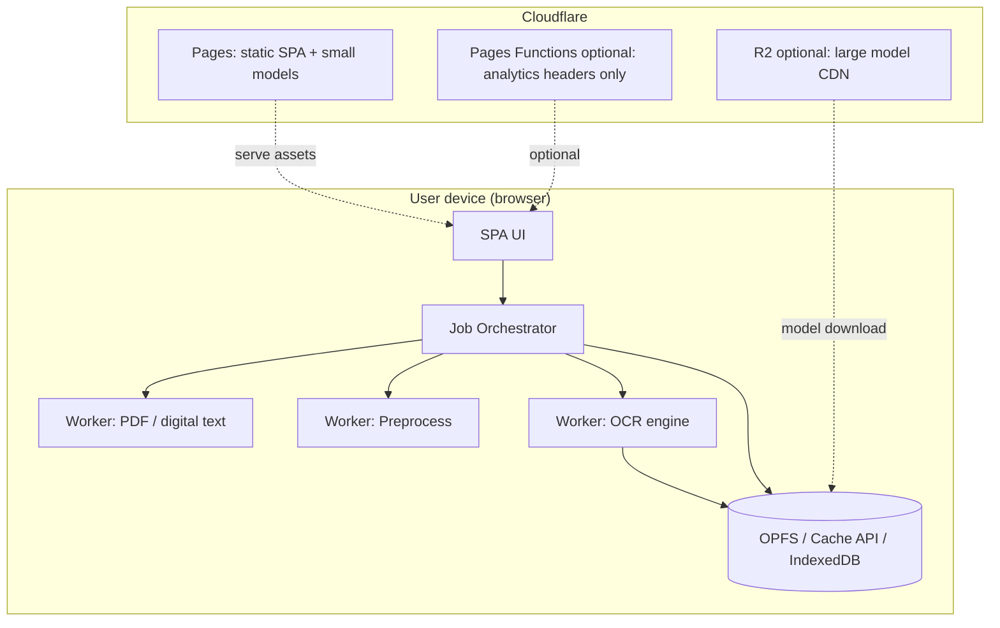

**Key decision:** OCR inference runs **only on the user device**. Cloudflare delivers code and models; it does not process document pixels for OCR in v1.

### 4.2 Processing flow (happy path)

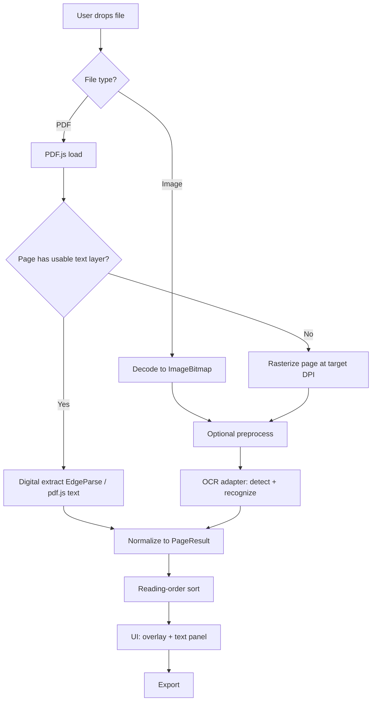

### 4.3 Engine adapter interface

```ts
// packages/ocr-core/src/types.ts (illustrative)
export type BBox = { x: number; y: number; w: number; h: number }; // page image coords

export type OcrBlock = {
  text: string;
  bbox: BBox;
  confidence: number; // 0–1
  level: 'page' | 'block' | 'line' | 'word';
};

export type OcrPageInput = {
  width: number;
  height: number;
  /** Transferable bitmap or ImageData */
  image: ImageBitmap | ImageData;
  languageHints?: string[];
  signal?: AbortSignal;
};

export type OcrPageResult = {
  blocks: OcrBlock[];
  fullText: string;
  engineId: string;
  durationMs: number;
};

export interface OcrEngine {
  readonly id: string;
  readonly capabilities: {
    languages: string[];
    webgpu: boolean;
    bboxes: boolean;
    confidence: boolean;
  };
  init(opts: { baseUrl: string; preferWebGpu?: boolean }): Promise<void>;
  recognize(input: OcrPageInput): Promise<OcrPageResult>;
  dispose(): Promise<void>;
}
```

**Adapters v1:**

1. `PaddleOnnxEngine` — default (ppu-paddle-ocr or client-ocr after spike)  
2. `TesseractEngine` — fallback / broad languages / OSD  
3. `DigitalPdfEngine` — not OCR; produces same `OcrPageResult` shape  

### 4.4 Monorepo layout (proposed)

```text
localOcr/
├── plan.md
├── docs/
│   └── ui/                 # mockups
├── apps/
│   └── web/                # Vite + React or SvelteKit static adapter
├── packages/
│   ├── ocr-core/           # types, orchestrator, reading order
│   ├── engine-paddle/      # adapter
│   ├── engine-tesseract/   # adapter
│   ├── engine-digital-pdf/ # pdf.js + edgeparse
│   └── ui-workspace/       # shared viewer components (optional)
├── public/models/          # or build step that publishes to R2
├── wrangler.toml / wrangler.jsonc  # if Functions used
└── research/               # gitignored clones
```

**Framework recommendation (Cloudflare skill aligned):** Prefer **Vite SPA** or **SvelteKit + `@sveltejs/adapter-cloudflare`** over deprecated Next-on-Pages. Avoid `@cloudflare/next-on-pages` (deprecated/unmaintained per CF skill gotchas).

### 4.5 Worker protocol (main ↔ OCR worker)

```text
Main → Worker:
  { type: 'init', engine: 'paddle'|'tesseract', baseUrl, preferWebGpu }
  { type: 'recognize', jobId, pageIndex, bitmap, lang, transfer: [bitmap] }
  { type: 'cancel', jobId }

Worker → Main:
  { type: 'ready', engineId, backend: 'webgpu'|'wasm' }
  { type: 'progress', jobId, pageIndex, fraction, message }
  { type: 'result', jobId, pageIndex, result: OcrPageResult }
  { type: 'error', jobId, pageIndex, code, message }
```

Use **Transferable** `ImageBitmap` to avoid structured-clone cost.

### 4.6 Model delivery strategy

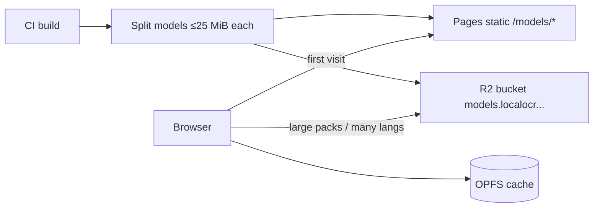

- Chunk or select model files so **no single asset exceeds 25 MiB** (Pages hard limit).  
- Prefer **R2 + custom domain** if packs approach the limit or multiply languages.  
- Cache with `Cache-Control: public, max-age=31536000, immutable` for versioned paths (`/models/v1/...`).

### 4.7 Optional Cloudflare edge (v1 = minimal)

| Component | Role in v1 | Role later |
|-----------|------------|------------|
| **Pages** | Host SPA + small models | Same |
| **R2** | Optional model CDN | Same |
| **Pages Functions / Worker** | Security headers, SPA fallback, health | Rate-limit optional cloud OCR proxy |
| **Workers AI** | **Not used for primary OCR** | Optional “enhance screenshot” experiment |
| **KV / D1** | None | Feature flags, telemetry aggregates |
| **Queues** | None | Only if cloud batch OCR appears |

Workers are **not** an OCR backend. Reasons in §6.

---

## 5. UI design

**Detailed frames:** [`docs/ui/`](docs/ui/) — open [`figma-frames.html`](docs/ui/figma-frames.html) for the editable Figma-style board.  
**Inspiration:** [setcalculators.com](https://setcalculators.com/) (DM Sans, indigo `#4f46e5`, cyan accent, pill controls, dual radial page wash, calm tool cards, privacy copy next to the action).

### 5.1 Design system

| Token | Value |
|-------|--------|
| Primary | `#4f46e5` / hover `#4338ca` / light `#eef2ff` |
| Accent | `#06b6d4` |
| Surfaces | bg `#f8fafc` · surface `#ffffff` · text `#0f172a` · muted `#64748b` |
| Radius | 8 / 12 / 20 · pills 999 |
| Type | **DM Sans** UI · **JetBrains Mono** scores/JSON |
| Tone | Calm utility tool (not flashy AI chrome) |
| Privacy | Persistent **On-device** pill; never fake server upload progress |

### 5.2 Screens (polished frames)

#### Landing / home

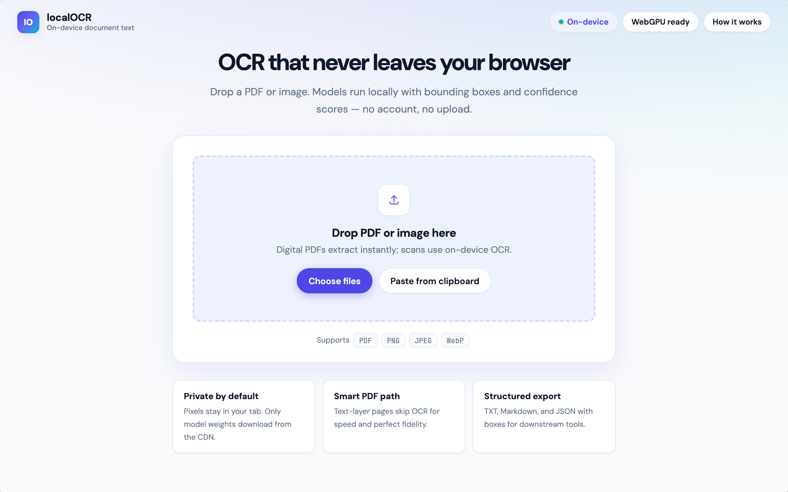

- Single focused drop card (setcalculators-style tool card)  
- Trust row: private · smart PDF · export  
- Pills: On-device · WebGPU · How it works  

#### Workspace (primary)

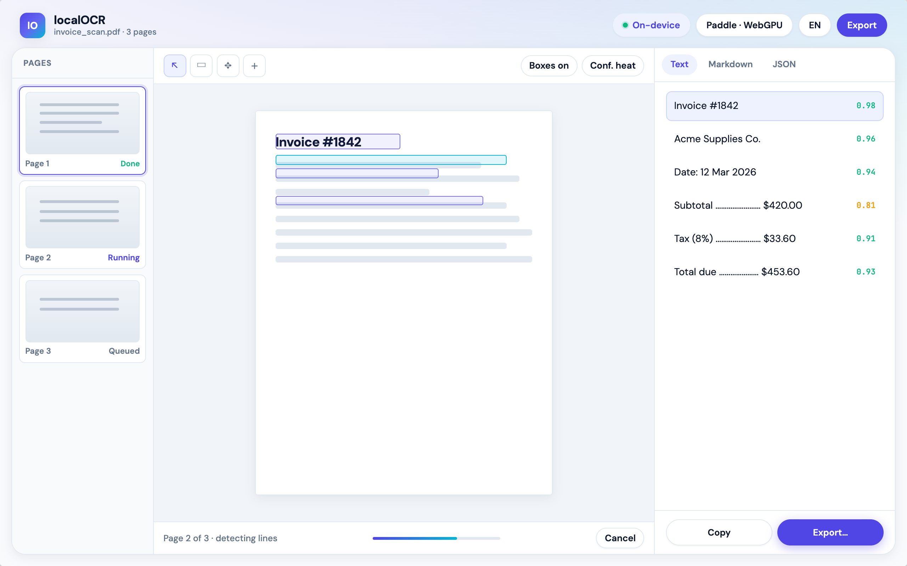

| Region | Content |
|--------|---------|
| Left **200px** | Page thumbnails + status |
| Center **1fr** | Toolbar · document canvas · bbox overlay · status bar |
| Right **340px** | Text / Markdown / JSON + confidence + export |

#### Export

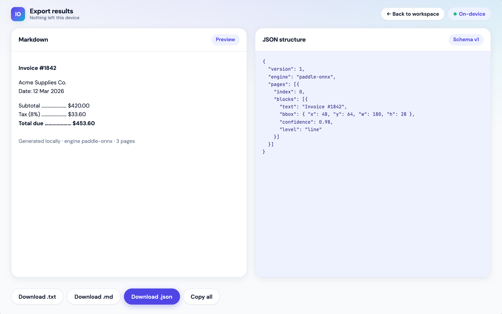

- Side-by-side Markdown preview + JSON schema  
- Downloads: TXT · MD · JSON · Copy  

#### Mobile

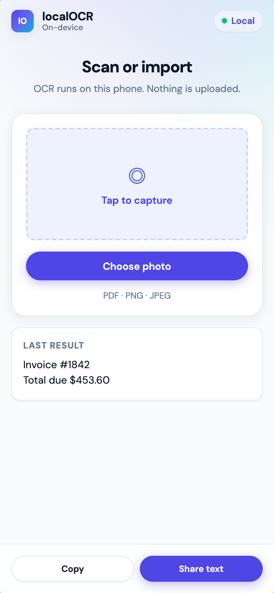

- Capture / import first; last-result card; capable subset of desktop  

#### Tokens & specs

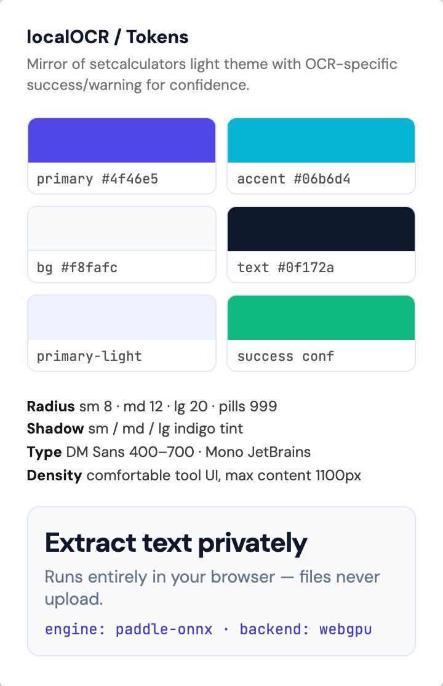
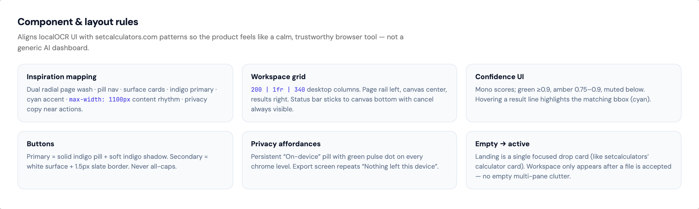

### 5.3 UX states

| State | UI |
|-------|-----|
| First visit | Model download progress with sizes & cancel |
| Ready | Landing drop card focus |
| Processing | Workspace; pages stream; cancel always visible |
| Partial failure | Page badge “failed”; rest continue |
| Low memory | Suggest lower DPI / single page |
| No WebGPU | “WASM mode · slower” chip; still works |

### 5.4 Accessibility

- Keyboard: open file, next/prev page, copy, cancel  
- Focus rings on bbox list items (`--color-focus-ring`)  
- Screen reader: announce page complete + error  
- Respect `prefers-reduced-motion`  

### 5.5 Board overview

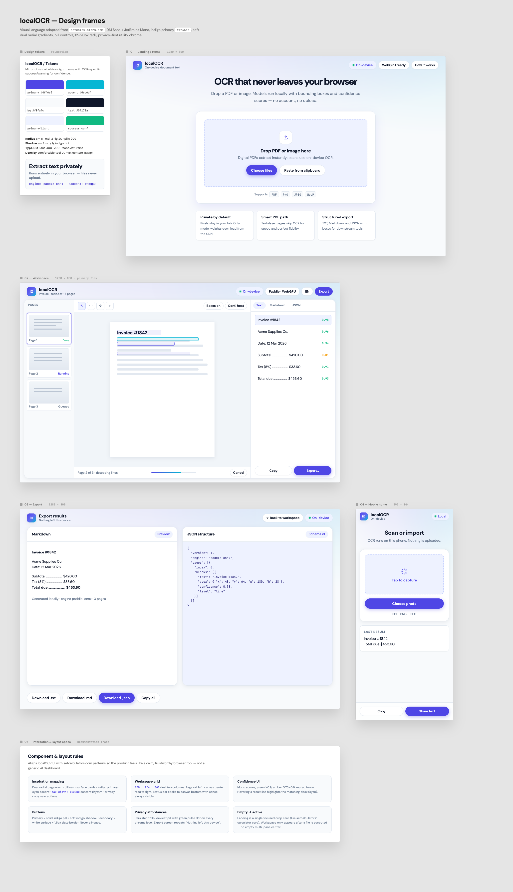

---

## 6. Cloudflare Pages / Workers compatibility

Validated against Cloudflare skill references and public limits docs.

### 6.1 What works well

| Capability | Fit |
|------------|-----|
| Static SPA on **Pages** | Ideal |
| CDN for JS/WASM/ONNX | Ideal |
| Free static requests | Ideal for model downloads |
| `_headers` for COOP/COEP if needed for threads | Supported for static |
| Optional R2 for large models | Recommended |
| Client-side only product | Aligns with privacy story |

### 6.2 Hard limits that shape design

| Limit | Value (per CF docs / skill refs) | Impact on localOCR |
|-------|----------------------------------|--------------------|
| **Pages max file size** | **25 MiB per asset** | Split models; use R2 for big packs |
| **Files per deploy** | 20,000 (plan-dependent higher on some paid) | Fine if models externalized |
| **Functions memory** | **128 MB** | Cannot load multi-model OCR pipelines |
| **Functions CPU** | Free ~10 ms; Paid default ~30 s (max 5 min) | Not enough for multipage OCR |
| **Script size** | 1 MB compressed free / 10 MB paid | App shell must stay lean; models not bundled into Worker |
| **No WebGPU in Workers** | Edge isolate is not a browser GPU | OCR acceleration is client-only |

### 6.3 Compatibility matrix

| Component | Runs on Pages static | Runs in browser | Runs on Workers |
|-----------|----------------------|-----------------|-----------------|
| SPA UI | ✅ served | ✅ executes | ❌ |
| Tesseract WASM | ✅ served | ✅ | ❌ impractical |
| Paddle ONNX + ORT Web | ✅/R2 served | ✅ | ❌ |
| PDF.js | ✅ | ✅ | ❌ (DOM/canvas) |
| EdgeParse WASM | ✅ | ✅ | Possible but wrong product split |
| Heavy doc VLM | ❌ too large / slow | ⚠️ experimental only | ❌ |

### 6.4 Recommended Cloudflare config sketch

```toml
# wrangler.toml — only if using Functions; static-first is OK without this
name = "localocr"
compatibility_date = "2026-07-20"
compatibility_flags = ["nodejs_compat"]

# Pages project: build output apps/web/dist
# Optional R2 binding for signed model URLs (later)
# [[r2_buckets]]
# binding = "MODELS"
# bucket_name = "localocr-models"
```

**Pages `_headers` example:**

```text
/models/*
  Cache-Control: public, max-age=31536000, immutable
  Access-Control-Allow-Origin: *

/*
  X-Content-Type-Options: nosniff
  Referrer-Policy: no-referrer
```

Cross-origin isolation (`COOP`/`COEP`) only if a chosen WASM build requires `SharedArrayBuffer`; measure first—can break some third-party embeds.

### 6.5 Framework choice (from CF skill)

| Option | Verdict |
|--------|---------|
| Vite + React/Svelte SPA | **Recommended** |
| SvelteKit + adapter-cloudflare | Good if SSR ever needed |
| Next.js on Pages | **Avoid** (official adapter deprecated) |
| Remix on Pages | **Avoid** (adapter deprecated) |

---

## 7. Limitations (product & technical)

### 7.1 Accuracy & document types

- Tables, multi-column magazines, dense forms, handwriting: **weaker than Mistral OCR 4 / Surya / olmOCR**.  
- Math / seals / stamps: unsupported in v1.  
- Very low-res phone photos: preprocess helps but not magic.  

### 7.2 Device & performance

- Large multipage PDFs can exhaust **tab memory**; process page-by-page and dispose bitmaps.  
- Low-end phones: default to mobile ONNX models + lower DPI.  
- First-run download can be **tens of MB**.  
- WebGPU not universal (Safari/Firefox variance); WASM fallback required.  

### 7.3 Platform

- Workers **cannot** host the OCR product path.  
- Pages **25 MiB** file ceiling forces model packaging discipline.  
- No server-side secret processing of user documents in v1 (by design).  

### 7.4 Legal / compliance messaging

- “On-device” must remain true for default path.  
- If a future cloud path is added, it must be **opt-in** with explicit consent UI.  
- Ship third-party licenses (Apache-2.0 Tesseract/Paddle, etc.) in `/licenses`.  

---

## 8. Implementation plan (phased)

### Phase 0 — Spike (3–5 days)

1. Clone research repos (§2).  
2. Build throwaway Vite app comparing **ppu-paddle-ocr** vs **client-ocr** vs **tesseract.js** on a fixed fixture set.  
3. Measure: cold load MB, cold init ms, page OCR ms, bbox quality, WebGPU availability.  
4. Verify each model file ≤25 MiB or split strategy.  
5. Write `research/SPIKE.md` with scores; lock default engine.

**Exit:** Default + fallback engines chosen; licenses OK.

### Phase 1 — Core pipeline (1–2 weeks)

1. Scaffold monorepo (`apps/web`, `packages/ocr-core`, engines).  
2. Implement `OcrEngine` interface + Tesseract adapter (known-good).  
3. Implement default Paddle/ONNX adapter.  
4. PDF.js multipage + digital text fast path.  
5. Orchestrator with cancel + progress.  
6. Minimal workspace UI: drop → text out.

**Exit:** Local demo processes image + scanned PDF + digital PDF.

### Phase 2 — Product UI & export (1 week)

1. Workspace layout (thumbnails, canvas, results).  
2. Bbox overlay + confidence coloring.  
3. Language picker + model cache UX.  
4. Export TXT/MD/JSON.  
5. Landing page + privacy copy.  
6. Deploy to Cloudflare Pages.

**Exit:** Public preview URL; privacy claims accurate.

### Phase 3 — Hardening (1 week)

1. Preprocess toggles (deskew optional).  
2. Region OCR.  
3. Memory pressure handling.  
4. Playwright e2e on fixtures.  
5. Performance budgets.  
6. Accessibility pass.

**Exit:** v1.0 release candidate.

### Phase 4 — Polish / v1.1

Searchable PDF, history, engine compare, more languages, PWA installability.

---

## 9. Testing strategy & acceptance criteria

### 9.1 Test layers

| Layer | Tools | Scope |
|-------|-------|-------|
| Unit | Vitest | reading-order, JSON schema, adapter normalization |
| Component | Testing Library | dropzone, progress, export buttons |
| Worker contract | Vitest + fake worker | message protocol, cancel |
| Fixture OCR | Node/browser harness | golden text similarity on fixtures |
| E2E | Playwright | full user flows in Chromium (+ WebKit smoke) |
| Perf | Lighthouse + custom marks | TTI, model init, page/sec |
| Deploy | CI | Pages build, asset size check ≤25 MiB |

### 9.2 Fixture corpus (check into `fixtures/`)

| Fixture | Purpose |
|---------|---------|
| `receipt_en.jpg` | Small English print |
| `scan_multipage.pdf` | 3-page scan |
| `digital_text.pdf` | Must use fast path (assert no OCR calls) |
| `two_column.pdf` | Reading order stress |
| `cjk_sample.png` | Non-Latin pack load |
| `low_contrast.jpg` | Preprocess value |
| `rotated_90.jpg` | OSD / rotate path |

### 9.3 Acceptance criteria (v1.0)

#### Functional

- [ ] **AC1** User can OCR a PNG without network after models cached (devtools offline).  
- [ ] **AC2** Digital PDF text extraction does not invoke OCR engine (instrumented assert).  
- [ ] **AC3** Scanned multipage PDF produces per-page text with progress and cancel mid-job.  
- [ ] **AC4** JSON export includes `text`, `bbox`, `confidence`, `pageIndex` for lines.  
- [ ] **AC5** Bboxes render aligned to preview within ±2 px at 100% zoom (sample page).  
- [ ] **AC6** Default engine init succeeds on Chrome latest desktop; falls back to WASM if no WebGPU.  
- [ ] **AC7** Switching language loads only required packs; English default works offline after cache.  
- [ ] **AC8** No document bytes sent to first-party analytics (network log empty of uploads).  

#### Performance budgets (desktop reference: M-series / mid Ryzen, Chrome)

| Metric | Budget |
|--------|--------|
| App shell JS (gzip) | ≤ 400 KB |
| Default EN model total download | ≤ 40 MB preferred; hard cap documented |
| Time to interactive (cached) | ≤ 3 s on broadband |
| Cold model init (cached) | ≤ 5 s |
| Single A4 page OCR (default engine) | ≤ 8 s p50  
| Memory: peak for 10-page job | No tab crash; dispose bitmaps each page |

#### Quality (relative, not SOTA)

| Metric | Criterion |
|--------|-----------|
| Character error rate on `receipt_en.jpg` | ≤ 5% vs human transcript |
| Digital PDF | Exact match on extractable text (whitespace-normalized) |
| User study n=5 internal | Prefer product over raw Tesseract demo for layout clarity |

#### Cloudflare deploy

- [ ] **AC9** `wrangler pages deploy` / Git integration succeeds.  
- [ ] **AC10** CI fails if any published asset > 25 MiB.  
- [ ] **AC11** `/models/*` serves with long-cache headers.  

#### Privacy

- [ ] **AC12** Privacy page states: processing local; models downloaded from CDN; no doc retention.  
- [ ] **AC13** Optional analytics is anonymized, off by default or privacy-friendly (e.g. CF Web Analytics without cookies).  

---

## 10. Integration map (complementary modules)

Avoid feature sprawl by mapping every module to a single pipeline stage.

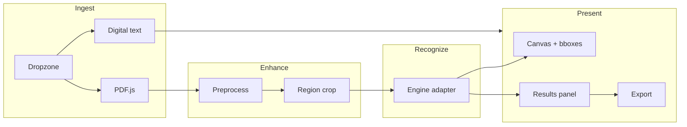

| Module | Complements | Must not become |
|--------|-------------|-----------------|
| Digital PDF path | Faster + better when possible | Separate app |
| Preprocess | Higher OCR accuracy | Photo editor product |
| Region OCR | Focused extraction | Full image suite |
| Dual engine | Quality when one fails | Confusing dual UX (hide under Advanced) |
| Export JSON | Downstream tools | API SaaS |
| History (IndexedDB) | Resume work | Cloud drive |

---

## 11. Future roadmap

### 11.1 Near-term (v1.x)

1. Searchable PDF export  
2. More language packs with selective download UI  
3. PWA (installable, offline shell)  
4. Better reading-order for multi-column (geometry heuristics)  
5. “Retry page with Tesseract” when confidence low  

### 11.2 Mid-term (v2)

1. Optional **layout model** (PP-DocLayout-class ONNX) for title/table/figure tags  
2. Lightweight table structure if model ≤ browser budget  
3. OpenDoc-0.1B / GLM-OCR WebGPU **experimental** engine behind flag  
4. Transformers.js TrOCR for hard single lines  
5. Batch folder mode with backpressure  

### 11.3 Long-term (opt-in cloud, still complementary)

1. **Optional** Worker proxy → self-hosted GPU OCR (Paddle/DeepSeek) or Mistral OCR 4 for hard pages only  
2. User toggle: “Send low-confidence pages to cloud” with redaction preview  
3. Enterprise self-host Docker for air-gapped  
4. Browser extension reusing `ocr-core`  

Cloud must remain **secondary** to preserve the brand: local by default.

### 11.4 Roadmap priority order

```text
v1.0  Local OCR + PDF + export + CF Pages
v1.1  Region, preprocess, searchable PDF, history
v1.2  Layout tags + multi-column heuristics
v2.0  Experimental browser VLM path
v2.x  Opt-in cloud for residual errors only
```

---

## 12. Key decisions

| Decision | Choice | Rationale |
|----------|--------|-----------|
| Primary runtime | **Browser**, not Workers | 128 MB / CPU limits; WebGPU lives client-side |
| Hosting | **Cloudflare Pages** (+ R2 for models) | Static-first, free egress-friendly CDN |
| Default OCR | **PP-OCR ONNX** (pending spike) | Speed/accuracy vs Tesseract for documents |
| Fallback OCR | **Tesseract.js** | Languages, OSD, maturity |
| PDF strategy | **Digital first, OCR second** | Efficiency + quality |
| Framework | **Vite SPA** (or SvelteKit CF adapter) | Avoid deprecated Next/Remix Pages adapters |
| Data model | Unified Job/Page/Block | Prevents feature fragmentation |
| Cloud OCR | **Not in v1** | Protects privacy promise |

---

## 13. Open questions

1. **Brand name:** localOCR vs Local OCR vs other?  
2. **Default engine finalist:** ppu-paddle-ocr vs client-ocr vs official paddleocr-js—resolve in Phase 0.  
3. **Analytics:** CF Web Analytics only vs none?  
4. **License of product code:** MIT/Apache-2.0 recommended for open-core.  
5. **Model hosting:** all on Pages vs R2 from day one? (Recommend R2 if EN+det+rec > ~20 MiB combined chunking pain.)

---

## 14. PR / implementation plan

| PR | Title | Scope | Depends on |
|----|-------|-------|------------|
| PR0 | chore: monorepo scaffold + CI | Vite app, packages, size gate | — |
| PR1 | feat: ocr-core types + orchestrator | Job/Page/Block, cancel | PR0 |
| PR2 | feat: tesseract engine adapter | Fallback engine | PR1 |
| PR3 | feat: paddle/onnx engine adapter | Default engine | PR1, Phase 0 |
| PR4 | feat: digital PDF + PDF.js raster | Ingest paths | PR1 |
| PR5 | feat: workspace UI + bbox overlay | Product UI | PR2–4 |
| PR6 | feat: export TXT/MD/JSON | Exports | PR5 |
| PR7 | feat: model cache + language packs | Offline UX | PR3 |
| PR8 | chore: Pages deploy + headers | Cloudflare | PR5 |
| PR9 | test: fixtures + Playwright + budgets | AC coverage | PR5–7 |
| PR10 | docs: privacy, licenses, README | Ship | PR8 |

---

## 15. Immediate next actions

1. Create `research/` and clone repos in §2.1.  
2. Run Phase 0 spike; write `research/SPIKE.md`.  
3. Scaffold `apps/web` with Vite + TypeScript.  
4. Implement `OcrEngine` + Tesseract path for vertical slice.  
5. Deploy empty shell to Cloudflare Pages to validate pipeline early.

---

## Appendix A — Privacy copy (draft)

> **Your documents stay on your device.** localOCR runs recognition in your browser using models downloaded to your machine. We do not upload your files to our servers for OCR. Model files are fetched from our CDN (or a mirror you configure) like any static website asset.

## Appendix B — JSON export schema (draft)

```json
{
  "version": 1,
  "engine": "paddle-onnx@x.y.z",
  "pages": [
    {
      "index": 0,
      "width": 1240,
      "height": 1754,
      "fullText": "...",
      "blocks": [
        {
          "text": "Invoice",
          "bbox": { "x": 120, "y": 80, "w": 200, "h": 36 },
          "confidence": 0.97,
          "level": "line"
        }
      ]
    }
  ]
}
```

## Appendix C — UI asset index

| File | Screen |
|------|--------|
| `docs/ui/landing.png` | Landing / dropzone |
| `docs/ui/workspace.jpg` | Main OCR workspace |
| `docs/ui/export.jpg` | Export panel |
| `docs/ui/mobile.jpg` | Mobile capture flow |

---

*This plan is the source of truth for v1. Update it when Phase 0 spike results change the default engine.*
